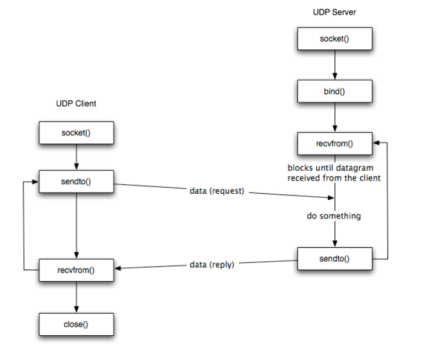

# **UDP Socket Programming**

 

## 1. **UDP(User Datagram Protocal) 이란?**

- 비연결 기반 서비스, **1:1, 1:N, N:N** 연결

- 목적지에 데이터가 도착함을 **보장하지 않는다**. 

- 체크섬 에러가 발생했거나, 데이터가 유실되었어도 자동으로 **데이터를 재전송하지 않는다**.

- 목적지의 **IP와 포트번호만** 알면 누구든지 데이터를 보낼 수 있다.

- **크기가 작고 실시간에 가까운 통신**이 필요할 때 사용(FPS 게임, 전화, 스트리밍 등)

## 2. **UDP 서버-클라이언트 연결 구조 및 API**

 

---

사진 출처: https://m.blog.naver.com/itperson/220932243494

---

- 동작방식

    1. **Server** - **bind()** 함수를 통해 특정 포트를 사용하고 선언한다음 데이터가 전송되기를 기다린다.

    2. **Cilent** - 서버에 출발지 IP, Port를 함꼐 담아 데이터를 전송한다.

    3. **Server** - 데이터와 함께 출발지 IP, Port를 분석해 알맞은 경우 특정 동작을 수행하고, 필요하다면 해당 IP, Port로 다시 어떤 정보를 전송한다.